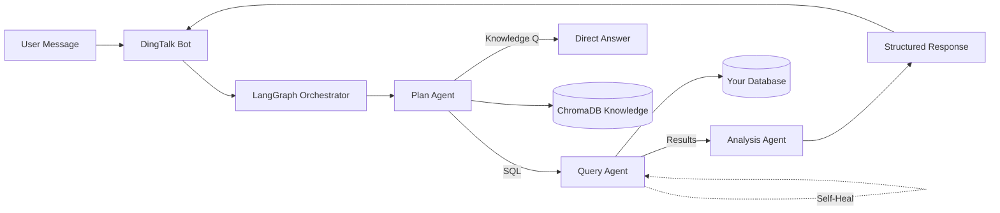

# AI Data Analysis Assistant

> An enterprise-grade AI data analyst powered by **LangGraph multi-agent architecture**.
> Query your data warehouse using natural language, get insights with actionable recommendations.
> Cost: **< $30/month**, replaces 1-2 junior data analysts.

[](LICENSE)
[](https://www.python.org/downloads/)
[](https://github.com/langchain-ai/langgraph)

---

## ✨ Features

- **Multi-Agent Collaboration (多智能体协作)** — Plan Agent (intent understanding + SQL generation) → Query Agent (execution + self-healing) → Analysis Agent (insights + recommendations)
- **Multi-Database Support (多数据库支持)** — MySQL, PostgreSQL, StarRocks (switch via config)
- **4-Layer Security (四层安全防御)** — Identity verification → Prompt injection prevention → SQL injection prevention → Audit logging
- **Self-Healing SQL (SQL 自愈)** — Automatic retry with LLM-powered SQL correction when queries fail or return empty results
- **Knowledge Base (知识库)** — ChromaDB-powered RAG for data dictionary and query patterns
- **Self-Learning Loop (自学习闭环)** — Learns from successful queries to improve over time
- **DingTalk Integration (钉钉集成)** — Enterprise messaging bot (adaptable to Slack/Teams)

---

## 🚀 Quick Start (Docker)

```bash
# 1. Clone
git clone https://github.com/jiajunshi123123-create/skadi.git
cd skadi

# 2. Configure
cp .env.example .env
# Edit .env with your API keys and database credentials

# 3. Run
docker-compose up -d
```

Verify the service is running:

```bash
docker-compose ps
docker-compose logs -f bot
```

---

## 🛠 Quick Start (Manual)

```bash
# 1. Install dependencies
pip install -r requirements.txt

# 2. Configure
cp .env.example .env
# Edit .env

# 3. Initialize database (PostgreSQL for experience store)
psql -U your_user -d your_db -f scripts/init_db.sql

# 4. (Optional) Initialize knowledge base
python knowledge/init_knowledge_base.py --reset

# 5. Run
python dingtalk_bot.py
```

---

## ⚙️ Configuration

### Required Environment Variables

| Variable | Description | Example |
|----------|-------------|---------|
| `DEEPSEEK_API_KEY` | DeepSeek API key (or any OpenAI-compatible) | `sk-xxx` |
| `DB_TYPE` | Target database type | `mysql` / `postgresql` / `starrocks` |
| `DB_HOST` | Database host | `localhost` |
| `DB_PORT` | Database port | `3306` |
| `DB_USER` | Database user | `readonly_user` |
| `DB_PASSWORD` | Database password | `your_password` |
| `DB_NAME` | Database name | `your_database` |
| `PG_HOST` | PostgreSQL (experience store) host | `localhost` |
| `PG_DATABASE` | Experience store DB name | `agent_experience` |
| `DINGTALK_BOT_APP_KEY` | DingTalk app key | `your_key` |
| `DINGTALK_BOT_APP_SECRET` | DingTalk app secret | `your_secret` |

### Data Dictionary

Define your tables in `config/data_dictionary.yml` — the agent will automatically understand your schema. See [knowledge/KNOWLEDGE-GUIDE.md](knowledge/KNOWLEDGE-GUIDE.md) for examples.

---

## 🏗 Architecture



**Three-Agent Pipeline:**

1. **Plan Agent** — Classifies intent (data query / knowledge / chitchat), generates SQL with RAG-augmented context
2. **Query Agent** — Executes SQL via the unified database adapter, self-heals on errors or empty results (max 2 retries)
3. **Analysis Agent** — Produces a 3-part response: **Data + Analysis + Recommendation**

For full design details, see [ARCHITECTURE.md](ARCHITECTURE.md).

---

## 💾 Supported Databases

| Database | Status | Notes |
|----------|--------|-------|
| MySQL 5.7+ / 8.0 | ✅ Supported | Via `pymysql` |
| PostgreSQL 12+ | ✅ Supported | Via `psycopg2` |
| StarRocks | ✅ Supported | MySQL protocol compatible |
| ClickHouse | 🔜 Planned | Coming soon |
| BigQuery / Snowflake | 🔜 Planned | Community contributions welcome |

Switch databases by editing the `DB_TYPE` variable — no code changes required.

---

## 💰 Cost Analysis

| Component | Monthly Cost |
|-----------|-------------|
| DeepSeek API (V4 Pro, ~50 queries/day) | ~$20 |
| Cloud Server (2C4G ECS) | ~$8 |
| **Total** | **< $30** |

Compared to a junior data analyst salary of **$3,000–5,000/month**, the ROI is roughly **100×**.

---

## 🔐 Security

- **Read-only by default** — Only `SELECT` statements allowed; `INSERT/UPDATE/DELETE/DROP` are blocked at the gate
- **EXPLAIN validation** — Every SQL statement is validated via `EXPLAIN` before execution
- **Partition filter enforcement** — Mandatory partition keys prevent full-table scans
- **Full audit trail** — Every query, permission check, and result is logged to PostgreSQL
- **Prompt injection defense** — User input sanitized before reaching the LLM

---

## 📚 Documentation

- [Deployment Guide](docs/DEPLOYMENT.md) — Docker, bare-metal, and cloud deployment
- [Architecture Details](ARCHITECTURE.md) — Internals of the multi-agent pipeline
- [Knowledge Base Guide](knowledge/KNOWLEDGE-GUIDE.md) — How to populate your data dictionary
- [Contributing](CONTRIBUTING.md) — How to contribute

---

## ❓ FAQ

**Why DingTalk?**
The system was originally built for an enterprise running on DingTalk. The `dingtalk_bot.py` module is a thin adapter — swap it for Slack, Teams, or a web interface without touching the agent pipeline.

**Why DeepSeek?**
Best price-to-performance ratio for both Chinese and English use cases. The system supports any OpenAI-compatible API — change `LLM_BASE_URL` in `.env`.

**Can I use my own LLM?**
Yes. Any OpenAI-compatible endpoint works (vLLM, Ollama, OpenRouter, Azure OpenAI, etc.).

**Is it production-ready?**
Yes. The system is running 24/7 in production, handling tens of thousands of queries with self-healing and audit logging.

---

## 🤝 Contributing

Contributions welcome! See [CONTRIBUTING.md](CONTRIBUTING.md) for details on how to get involved.

---

## 📄 License

MIT License — see [LICENSE](LICENSE) for details.
